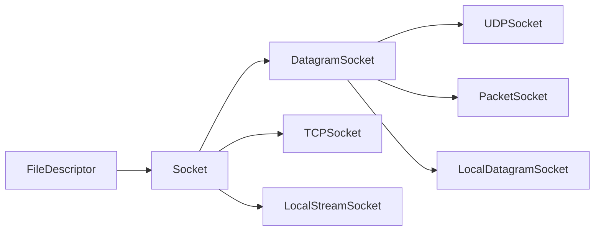

## Networking by hand

### 1. Fetch a Web page using `telnet`  

```
❯ telnet cs144.keithw.org http
Trying 104.196.238.229...
Connected to cs144.keithw.org.
Escape character is '^]'.
GET /hello HTTP/1.1
Host: cs144.keithw.org
Connection: close

HTTP/1.1 200 OK
Date: Fri, 09 Feb 2024 12:41:01 GMT
Server: Apache
Last-Modified: Thu, 13 Dec 2018 15:45:29 GMT
ETag: "e-57ce93446cb64"
Accept-Ranges: bytes
Content-Length: 14
Connection: close
Content-Type: text/plain

Hello, CS144!
Connection closed by foreign host. 
```

### 2. Send yourself an email

```
// I am NOT an SNU Student :(
```

### 3. Listening and connecting

```
❯ netcat -v -l -p 9090
Connection from 127.0.0.1:45522
Kenshin2438
```

```
❯ telnet localhost 9090
Trying ::1...
Connection failed: Connection refused
Trying 127.0.0.1...
Connected to localhost.
Escape character is '^]'.
Kenshin2438
^]
telnet> close
Connection closed.
```

## Socket `webget()`



`[Class] Socket` constructor method declared with the `protected` access specifier, which means that the constructor can only be accessed by **member function** or **friends of the class**, or by **derived classes**. This is often used in inheritance to prevent direct instantiation of a base class while allowing derived classes to access the constructor for initialization purposes.

---
Steps:
1.  Declare a Socket server by `TCPSocket sock {};` 
2. Networking by hand ( Be careful to `<space>` o.O? )

```
❯ cmake --build build --target check_webget
Test project /home/kenshin/Documents/CS144/build
    Start 1: compile with bug-checkers
1/2 Test #1: compile with bug-checkers ........   Passed    1.74 sec
    Start 2: t_webget
2/2 Test #2: t_webget .........................   Passed    2.44 sec

100% tests passed, 0 tests failed out of 2

Total Test time (real) =   4.18 sec
Built target check_webget
~/Documents/CS144 main* ❯ 
```

## Implementation for `bytes_stream.[hh/cc]`
+ `[Class] Writer ==> Producer (Bytes)`
+ `[Class] Reader ==> Consumer (Bytes)`
+ `pipe` is all you need (O.o?)
	1. A `buffered-container` for better performance;
	2. Or, just using `std::string` (real `[Push/Pop]` operation).

```
❯ cmake --build build --target check0
Test project /home/kenshin/Documents/CS144/build
      Start  1: compile with bug-checkers
 1/10 Test  #1: compile with bug-checkers ........   Passed    7.52 sec
      Start  2: t_webget
 2/10 Test  #2: t_webget .........................   Passed    2.41 sec
      Start  3: byte_stream_basics
 3/10 Test  #3: byte_stream_basics ...............   Passed    0.02 sec
      Start  4: byte_stream_capacity
 4/10 Test  #4: byte_stream_capacity .............   Passed    0.02 sec
      Start  5: byte_stream_one_write
 5/10 Test  #5: byte_stream_one_write ............   Passed    0.02 sec
      Start  6: byte_stream_two_writes
 6/10 Test  #6: byte_stream_two_writes ...........   Passed    0.02 sec
      Start  7: byte_stream_many_writes
 7/10 Test  #7: byte_stream_many_writes ..........   Passed    0.10 sec
      Start  8: byte_stream_stress_test
 8/10 Test  #8: byte_stream_stress_test ..........   Passed    0.06 sec
      Start 37: compile with optimization
 9/10 Test #37: compile with optimization ........   Passed    6.33 sec
      Start 38: byte_stream_speed_test
             ByteStream throughput: 0.80 Gbit/s
10/10 Test #38: byte_stream_speed_test ...........   Passed    0.33 sec

100% tests passed, 0 tests failed out of 10

Total Test time (real) =  16.84 sec
Built target check0
```